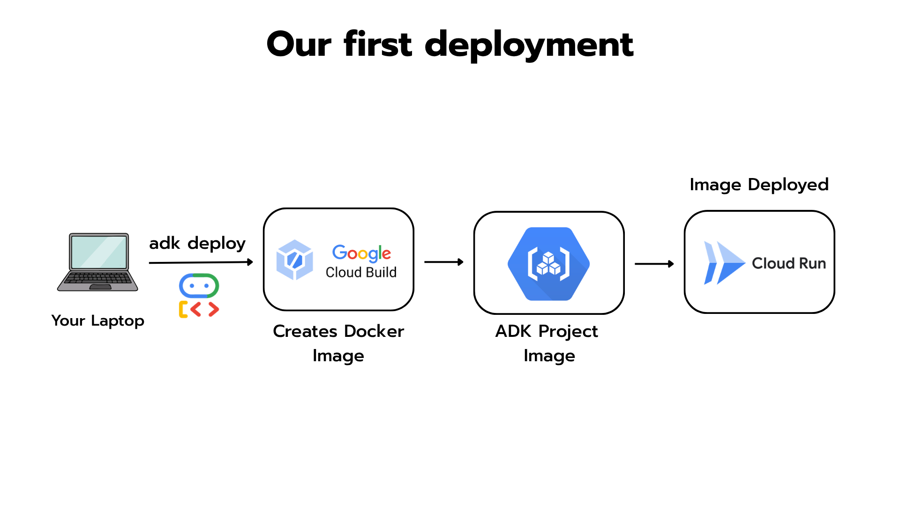

# Deploying your first Agent to Cloud Run



You built an agent in `06_adk_react_agent.ipynb`. It ran in your notebook. Now we deploy that same agent to **Google Cloud Run** — a real HTTPS endpoint anyone can hit.

We're keeping this **deliberately simple**:

- 🚫 No Dockerfile — ADK writes one for us, server-side, via Cloud Build. You won't even see it.
- 🚫 No CI/CD — we deploy from our terminal.
- 🚫 No persistent sessions — every request is a fresh session (fine for stateless Q&A).

In future weeks we'll keep layering more on top — Dockerfiles, `docker-compose`, a local Qdrant, persistent sessions, auth, and the rest. Today, the goal is small: **agent in the cloud, in 5 steps.**

## What's in this folder

```
deployment/
├── README.md          ← you're reading it
├── .env.example       ← template for PROJECT_ID, REGION, COHERE_API_KEY (copy to `.env`)
└── src/
    ├── __init__.py    ← required boilerplate for ADK
    ├── agent.py       ← the agent + 3 tools
    └── requirements.txt   
```

The agent ships with the same three tools as Lab 6: `calculator`, `lookup`, and `get_today`.

## Prerequisites

1. A Google Cloud account with billing enabled (the free tier covers this entire lab — Cloud Run gives you 2M requests/month).
2. The **gcloud CLI** installed locally: <https://cloud.google.com/sdk/docs/install>
3. Your **Cohere API key** in `$COHERE_API_KEY`.

## Setup (one-time)

The repo ships a `.env.example` with the three variables every step below reads from. **Don't edit `.env.example` directly** — copy it and fill in your own values:

```bash
# From the week1/ folder
cp .env.example .env
# then edit .env and replace the placeholders with your real PROJECT_ID + COHERE_API_KEY
```

Once `.env` is filled in, load it into your shell. `set -a` tells the shell to *export* every variable that gets assigned, so child processes (gcloud, adk) inherit them — without it, `source .env` would only set them in the current shell:

```bash
set -a; source .env; set +a
```

Now the actual setup:

```bash
# 1. Log in
gcloud auth login

# 2. Point gcloud at the project we just sourced
gcloud config set project "$PROJECT_ID"

# 3. Enable the APIs we'll need
gcloud services enable \
    run.googleapis.com \
    cloudbuild.googleapis.com \
    artifactregistry.googleapis.com \
    secretmanager.googleapis.com

# 4. Derive the runtime service account Cloud Run will use.
#    Cloud Run runs revisions as the project's default compute service account
#    unless you override it. We'll need its email in Step 1 to grant secret access.
#    These two are *derived* from $PROJECT_ID, so they don't live in .env.
export PROJECT_NUMBER=$(gcloud projects describe "$PROJECT_ID" --format='value(projectNumber)')
export RUNTIME_SA="${PROJECT_NUMBER}-compute@developer.gserviceaccount.com"

# 5. Grant the compute SA the roles Cloud Build needs.
#    Since GCP's April 2024 service-account change, `adk deploy` / `gcloud run deploy
#    --source` runs the build as the *compute* SA — and on a brand-new project that
#    SA has no roles, so the build fails with:
#       "<num>-compute@developer.gserviceaccount.com does not have
#        storage.objects.get access to the Google Cloud Storage object"
#    `cloudbuild.builds.builder` bundles GCS source read, Artifact Registry push,
#    and Logging write — everything the build needs.
gcloud projects add-iam-policy-binding "$PROJECT_ID" \
    --member="serviceAccount:${RUNTIME_SA}" \
    --role="roles/cloudbuild.builds.builder"
```

> 💡 **Opening a new terminal later?** Re-run `set -a; source .env; set +a` (and the `PROJECT_NUMBER` / `RUNTIME_SA` exports) before continuing — env vars don't persist across shells.

---

## Step 1 — Store your Cohere key in Secret Manager

**Never** put API keys in source code, in env files committed to git, or directly in Cloud Run config. Always Secret Manager.

```bash
echo -n "$COHERE_API_KEY" | gcloud secrets create cohere-api-key \
    --replication-policy=automatic \
    --data-file=-
```

Then grant the Cloud Run runtime service account permission to read it. Without this, Step 3 fails with `Permission denied on secret`:

```bash
gcloud secrets add-iam-policy-binding cohere-api-key \
    --member="serviceAccount:${RUNTIME_SA}" \
    --role="roles/secretmanager.secretAccessor"
```

## Step 2 — Deploy with one command

From the current folder:

```bash
adk deploy cloud_run \
    --service_name=conference-agent \
    --region="$REGION" \
    --with_ui \
    src/
```

What this does, behind the scenes:

1. Packages your `src/` folder.
2. Ships it to **Cloud Build**, which writes a Dockerfile and builds a container.
3. Pushes the image to **Artifact Registry**.
4. Deploys to **Cloud Run** with a stable HTTPS endpoint.
5. The `--with_ui` flag adds ADK's web chat interface so you can talk to your agent in a browser.

First deploy takes ~5 minutes. Subsequent deploys are faster.

## Step 3 — Wire the Cohere secret into the service

```bash
gcloud run services update conference-agent \
    --region="$REGION" \
    --update-secrets=COHERE_API_KEY=cohere-api-key:latest \
    --cpu=2 \
    --memory=1Gi
```

The agent container can now read `COHERE_API_KEY` as a regular env var, but the actual secret value lives in Secret Manager — never in the container, never in logs.

We also bump the revision to **2 vCPU / 1 GiB**. The ADK defaults (1 vCPU / 512 MiB) are tight once the agent runtime and Cohere client are loaded, and a slightly bigger machine shortens cold starts. You can verify with `gcloud run services describe conference-agent --region="$REGION" --format='yaml(spec.template.spec.containers[0].resources)'`.

## Step 4 — Allow public access (for the demo)

```bash
gcloud run services add-iam-policy-binding conference-agent \
    --region="$REGION" \
    --member=allUsers \
    --role=roles/run.invoker
```

For real production you'd put auth in front of this. For a learning lab, public is fine.

## Step 5 — Use your agent

Get the service URL:

```bash
gcloud run services describe conference-agent \
    --region="$REGION" \
    --format='value(status.url)'
```

Open that URL in your browser — you'll see ADK's web chat UI. Ask the agent:

- *"What's the total ticket revenue, and when is the conference?"* → it'll use `lookup` + `calculator`.
- *"How many days until the conference?"* → it'll use `get_today` + `calculator`.
- *"Where is the conference being held?"* → it'll use `lookup`.

**You just deployed an agent to production.** 🎉

---

## When you're done — clean up

Cloud Run's free tier covers idle services, but cleanup is a good habit and the Artifact Registry image storage is *not* free. Run these from the same shell where `$PROJECT_ID` and `$REGION` are still set.

```bash
# 1. Delete the Cloud Run service (also drops the public-invoker IAM binding)
gcloud run services delete conference-agent --region="$REGION" --quiet

# 2. Delete the Secret Manager secrets
gcloud secrets delete cohere-api-key --quiet

# 3. Delete the Artifact Registry repo that `adk deploy` created for the image.
#    ADK uses the `cloud-run-source-deploy` repo by default in the deploy region.
gcloud artifacts repositories delete cloud-run-source-deploy \
    --location="$REGION" --quiet
```

Confirm nothing is left:

```bash
gcloud run services list --region="$REGION"
gcloud secrets list
gcloud artifacts repositories list --location="$REGION"
```

## Troubleshooting

**`adk deploy cloud_run` says my project isn't found.** Run `gcloud config set project YOUR_PROJECT_ID` and try again.

**Deploy fails with `<num>-compute@developer.gserviceaccount.com does not have storage.objects.get access`.** You skipped (or are on a project that pre-dates) Setup step 5. Run the `add-iam-policy-binding` for `roles/cloudbuild.builds.builder` and retry. This is a one-time grant per project.

**The first request takes ages.** That's the *cold start* — the container has to boot from zero. Cloud Run scales to zero by default. Subsequent requests within a few minutes will be fast.

**The agent returns nothing or hangs.** Open Cloud Logging in the Google Cloud Console (`gcloud logs read` also works) and check the service logs. Most of the time it's either a missing env var or a `LiteLlm` model name typo.

**I want to redeploy after changing the code.** Just re-run Step 2 — `adk deploy cloud_run` will rebuild and roll out a new revision in place.

**Step 3 still says `Permission denied on secret`.** The default compute service account (`${PROJECT_NUMBER}-compute@developer.gserviceaccount.com`) may not exist on newer GCP projects where the org policy `iam.automaticIamGrantsForDefaultServiceAccounts` is disabled. Check which service account your revision actually runs as with `gcloud run services describe conference-agent --region="$REGION" --format='value(spec.template.spec.serviceAccountName)'` and grant the `roles/secretmanager.secretAccessor` role to *that* account instead.
